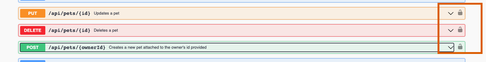

# Noel's Pet-office backend
## A REST-API built using Spring Boot and MYSQL.
---

## This repository contains the source code for the project. However, some important things to note are:
**To run project you would need to:**
1. Have MYSQL installed.
2. Create a database called pets_db (don't add any tables, just create it).
3. Have Java 17 installed       
**To change the JWT key (which is the one used to generate the tokens), you need to:**
 1. Get one online using sites like: [Key Generator](https://allkeysgenerator.com/Random/Security-Encryption-Key-Generator.aspx)
 2. Change it inside application.properties

## How to use

### To run application
All you need to do is run the following command in your terminal:
> `mvn spring-boot:run`

(If project doesn't run, check important noves above.)

If everything works, you should get something like this 

### To use application
The application is exposed to swagger UI. Swagger adds self documentation to the REST api and it Swagger UI allows anyone to be able to use the endpoints without really any knowledge of the API. 
To navigate to Swagger UI go to: http://localhost:8080/swagger-ui/index.html#/

It should open the following:

### To use Swagger UI
Once you are in the swagger ui, you can click on any of the endpoints, they all include a bit of information about what they do.

---
**NOTE**

The database will be empty when you first run the project. The first thing you'll want to do is use the **Authentication Controller** to register an user.

----

**- How to register an user**  

You need to use the */api/auth/register* endpoint. Once you open it (by clicking on it) and clicking on "Try it out" you should see the following: 
Here you are receiving an example of what you need to enter, you can modify the fields to what you want. Once you are done clikc on *"Execute"* and you should see the following:

----

**- How to use locked endpoints using JWT token**
You can see that some of the endpoints have a lock on the right side 
For these endpoints you will have to authenticate or register an account. Once you do you will get a token, like in the example above. You need:

1. Copy the token. 
2. Click the lock icon on one of the endpoints.
3. Paste the token and then click "Authorize". 
4. Click ok, then close.
5. Use the endpoint.

---

**- How NOT to use locked endpoints**
If you do not use the token given to you and try to use one of the endpoints, you will get a 403 error.
